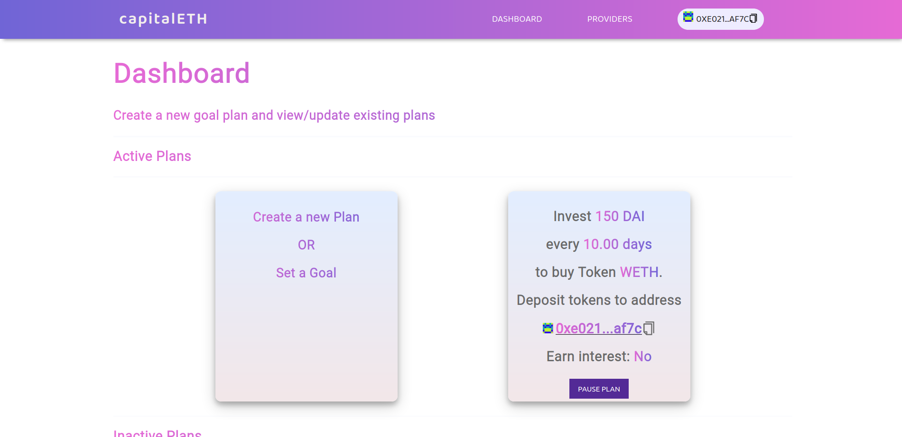
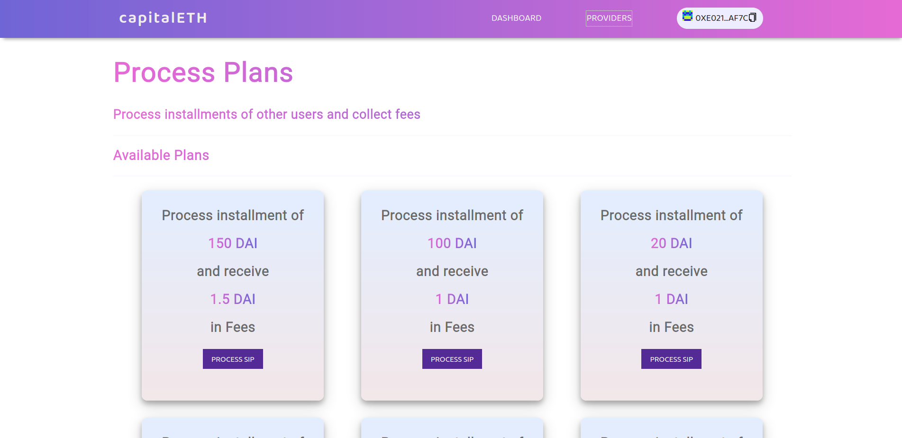

# Introduction

capitalETH aims to solve a major problem in Decentralized Finance - Investing.
capitalETH helps you invest systematically and in a disciplined way so you can sit tight and invest right! 

## What is capitalETH?

capitalETH is a smart and hassle-free way of investing in cryptocurrencies just like a Systematic Investment Plan (SIP) in traditional finance. A capitalETH SIP is a planned approach towards investments and helps you build the habit of saving and building a portfolio for future.

Using capitalETH, you can invest a pre-determined amount at regular intervals. Investing small amounts regularly in the market averages out the buy price during highs and lows and reduces the risk significantly. 

## Why capitalETH?

Investing in decentralized cryptocurrencies has largely been ignored in the DeFi space. There are many people who are interested to be a part of this DeFi revolution and want to hold a stake in the ecosystem. New and less experienced people are often very confused about where to invest and most importantly when to invest. Volatility is very high in crypto markets and people are very skeptical about the best time to invest and in turn miss opportunities trying to time the entry. Majority of the people still invest based on anonymour tips and Fear of Missing Out (FOMO). 

## Advantages

- Dollar cost averaging
- Compounding of investments
- Disciplined Saving
- Long term gains
- No need to monitor the market continously 

## Deployment instructions

The current repository has all the token address of Ropsten network. If you want to deploy to any other networks, or a local fork of main network, you need to change the token address (all tokens addresses are updated in the `src/utils` directory)

To deploy:

- Clone this repository
- Run `npm install`
- Deploy contracts using `truffle deploy [--network ropsten]` (You need to have a .secret file in the current directory with your mnemonic if deploying to any network other than local)
- Update the contract deployed contract address
- Set kyberNetworkProxyContract address and Aave address(Interest earning using Aave will only work on mainnet fork as both Kyber and Aave use different contract deployments for DAI)
- `npm start`

## Deployed App

capitalETH is currently deployed on the Ropsten test network and [lives here](https://capitaleth.netlify.app/)

### Investors Dashboard view

### Providers Process view

## Other details

This project was built in less than 30 days for the ETHGlobal HackMoney Hackathon. I would really like to thank the entire ETHGlobal, Aave and Portis team and everyone else for their support. Thank you.
